### THM-VulnNet: Dotpy

# Description

- Difficulty: Medium
- O.S: Linux

# Enumeration

To see which ports are open and which services are running in this machines I used nmap.

```bash
nmap <ip> -p- --open -sS --min-rate 5000 -vvv -Pn -n -oG allports
```

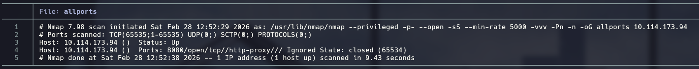

```bash
nmap <ip> -p8080 -sCV -oN targeted
```

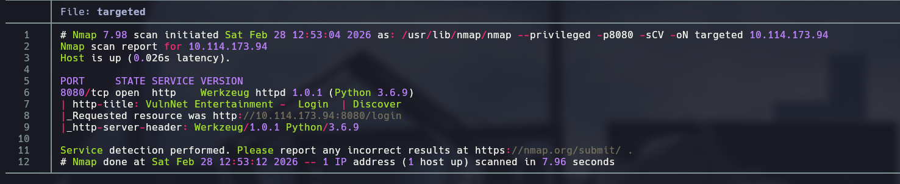

Port 8080 running, seems like a web page.

The first thing I see is a login, so I created an account.

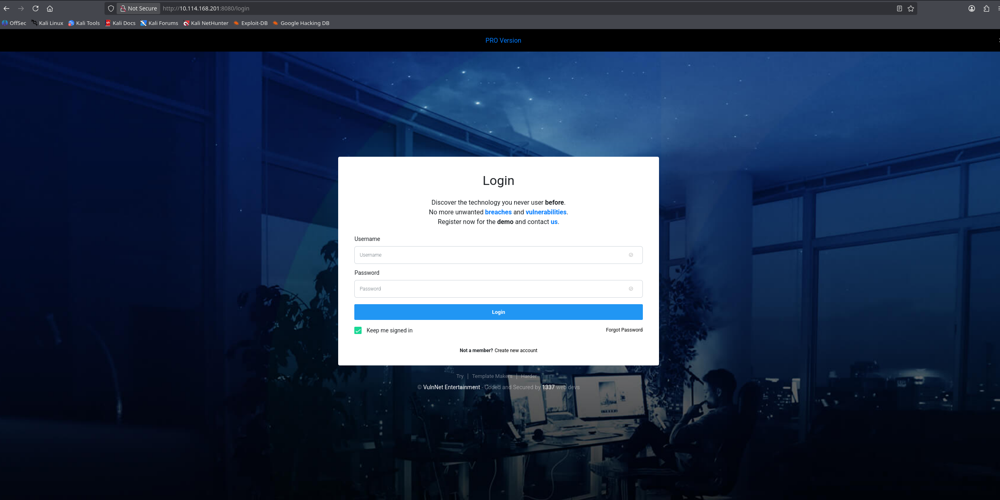

This is the main page:


Looking the page if I try to enter a directory that no exists I see this template:

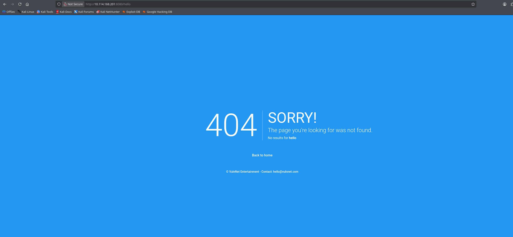

# Exploitation

Looking the template i tried a Server Side Template Injection and it worked:

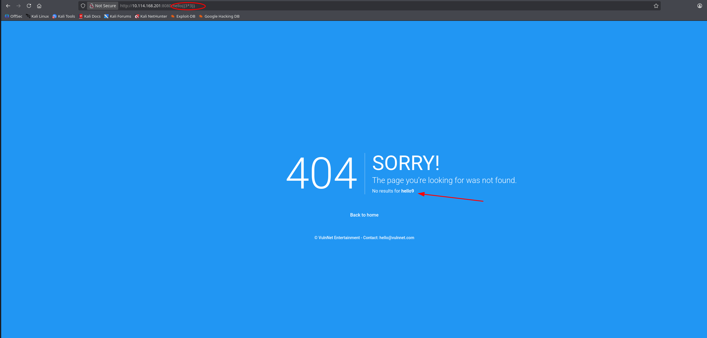

SSTI: Server-Side Template Injection (SSTI) is a high-severity web vulnerability that occurs when an attacker is able to inject malicious input into a server-side template, causing the application to execute arbitrary code.

Trying to exploit the SSTI I found that the system has restrictions.

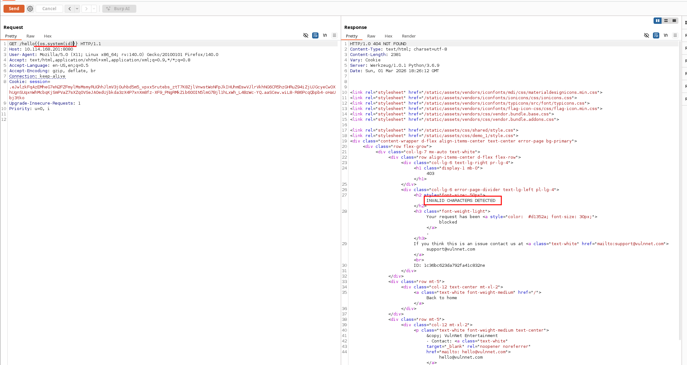

Thanks to the payload all the thinks [repository](https://github.com/swisskyrepo/PayloadsAllTheThings/blob/master/Server%20Side%20Template%20Injection/Python.md)  I found a payload that can evade the restrictions and be able to execute commands:

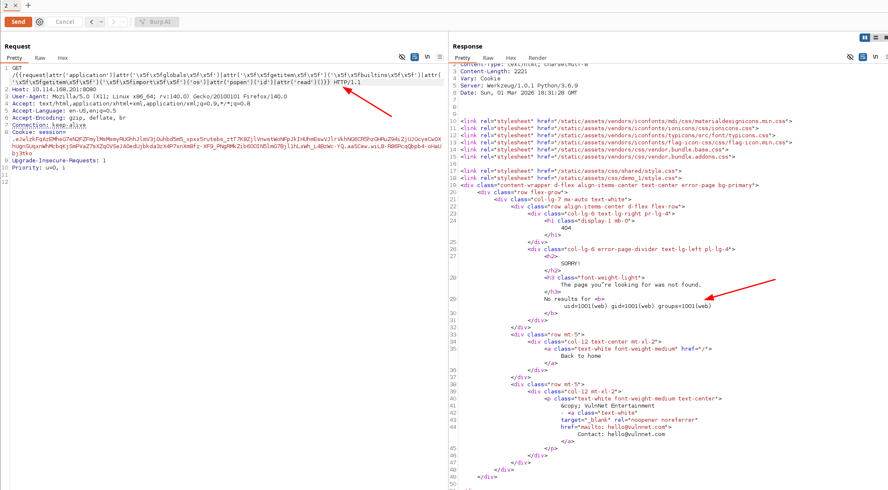

Now instead of the 'id' command I inserted a python reverse shell in hex.

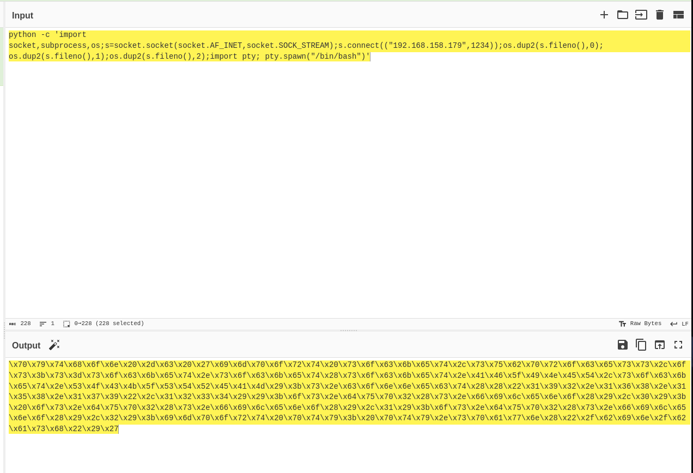

I started the listener and now I am inside with user 'web'.

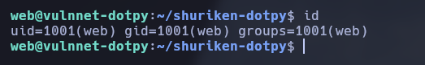

# Privilege Escalation

With sudo -l I can execute '/usr/bin/pip3 install'  with the user 'system-adm'.

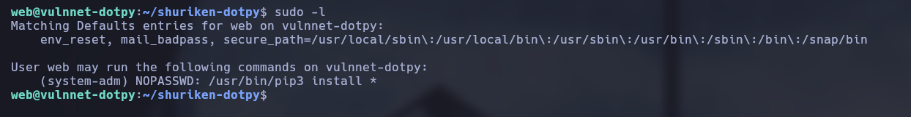

Looking [GTFObins](https://gtfobins.org/gtfobins/pip/) I can escalate privileges.

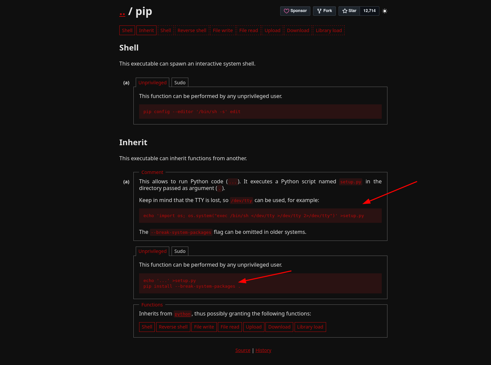

Now I'm the user system-adm.

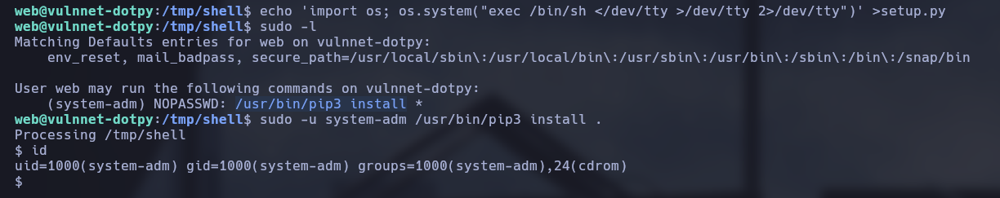

If I do another sudo -l I find that execute like root changing the env without password /usr/bin/python3 /opt/backup.py

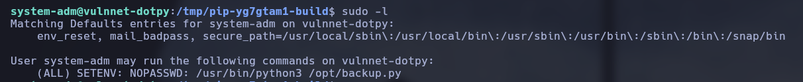

I can exploit this SETENV: with PYTHONPATH hijack, to do this I created a file named zipfile.py because is the library the script uses and I entered a python reverse shell inside, then I executed the backup.py and gained the root reverse shell:

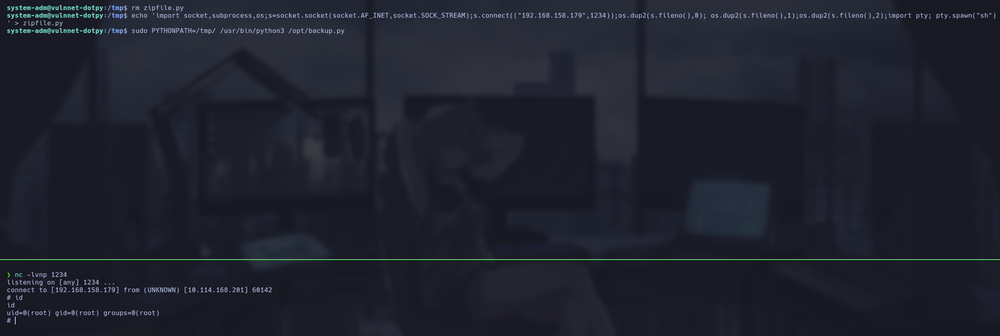

# Lessons learned

-  How to exploit a SSTI with restrictions in a python environment.
-  How to use pip3 to escalate privileges.
-  How to pythonpath hijack using a script with sudo privileges.